# Первая часть

### 1. Использую git status, чтобы определить состояние файлов 

### 2. Использую git log, чтобы просмотреть историю изменения файлов

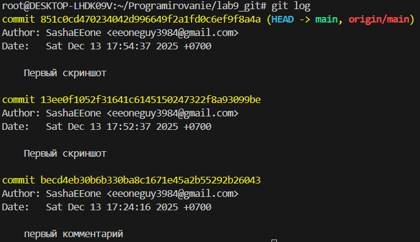

### 3. Создал sort.c

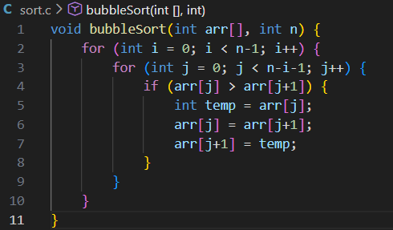

### 4. Как сейчас выглядит git status. P.S (я сразу стал делать add, commit и push, поэтому пропущу пункты до 9)

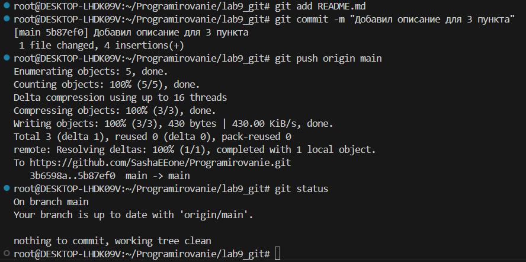

### 9-10. Добавил комментарий с любым текстом в этот же файл, git status выглядит так

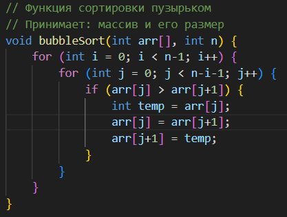 

### 11-12. Добавил изменения файла и посмотрел как сейчас выглядит git status

 

### 13-14-15. Изменил файл еще раз, сделал коммит, посмотрел как выглядит git status, log

 

### 16-17. Добавил в stage и закоммитил последнее изменение, запушил на удаленный репо

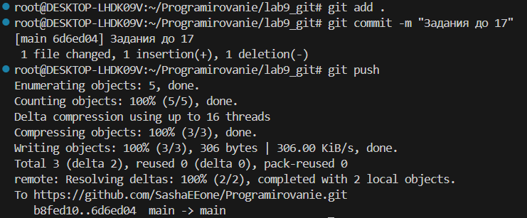 

# Вторая часть

### 1-2-3. Добавил в stage и закоммитил последнее изменение, запушил на удаленный репо

 

### 4-5. В git status изменилось: On branch main or On branch mybranch, далее убедился, что нахожусь на ветке - mybranch

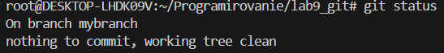 
 
 

### 6-7. Создал file.1.txt, добавил туда свое имя и закоммитил

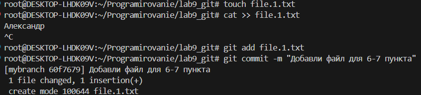 

### 8. Использую git log --oneline --graph, чтобы увидеть, что моя ветка указывает на новые коммиты

### 9-10. Вернулся на ветку main, использовал git log --oneline --graph, изменилось: коммит из ветки mybranch не будет виден на ветки main   

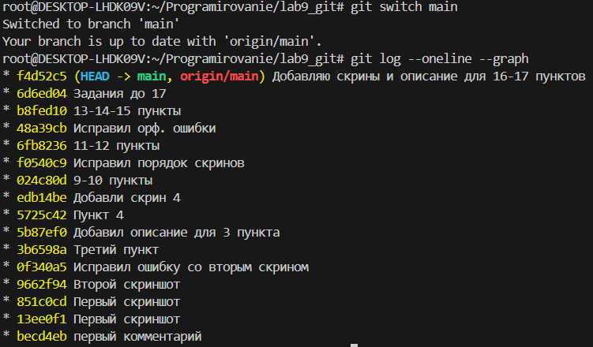

### 11-12. Создал новый файл file2.txt, закоммитил его. Использовал git log --oneline --graph --all, чтобы увидеть, что наша ветка указывает на новый коммит, и что теперь у двух веток разные коммиты

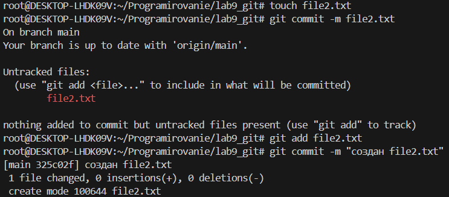
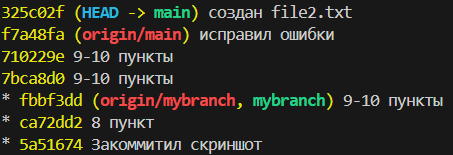

### 13-14. Переходим на ветку mybranch и проверяем исчезновение file2.txt

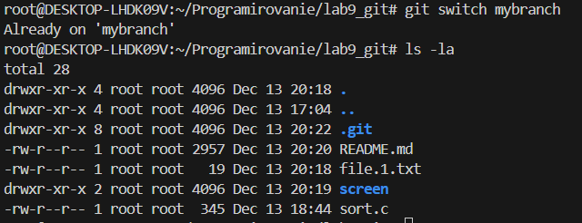

### 15. Используя git diff mybranch main чтобы увидеть разницу между двумя ветками.

# Задание на чертверку

### 1. Переключаюсь на ветку mybranch

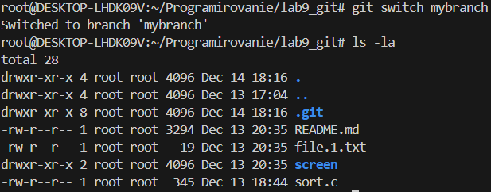

### 2. Перезапиcываю содержимое в sort.c

### 3-4. Использую git diff (смотрю, что поменялось) и git diff --staged (какие изменения в staged)

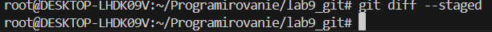

### 5-7. Добавляю в staged файл sort.c, смотрю, что говорит git diff и git diff --staged

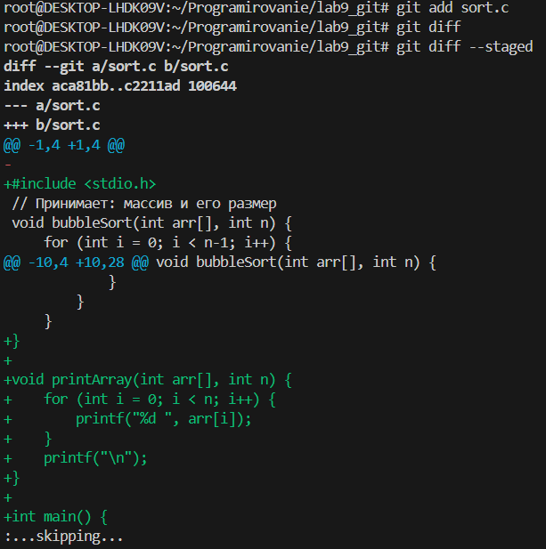

### 8-10. Удаляю любое из чисел в массиве в sort.c, смотрю, что говорит git diff и git diff --staged

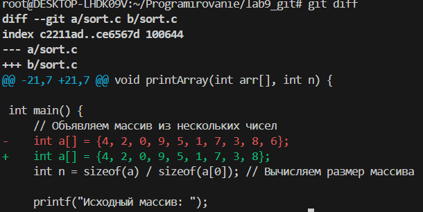

### 11. Когда мы удалили число после git add, это новое изменение находится в рабочей директории, но не в staged

### 12. Использовал git status и обратил внимание, что sort.c присутствует дважды в выводе.

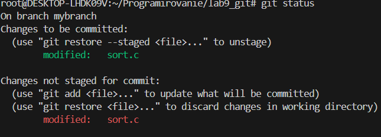

### 13-14. Использовал git restore --staged sort.c, чтобы отменить индексацию изменения , посмотрел, что говорит git status?

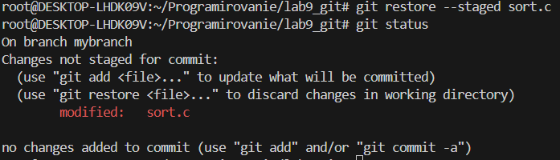

### 15-16. Индексировал изменения и сделал коммит. Посмотрел как выглядет журнал

### 17-18. Добавил в sort.c в main() printf(“hello git\n”);. Использовал cat, чтобы посмотреть содержимое

### 19-22. Использовал git status, restore sort.c

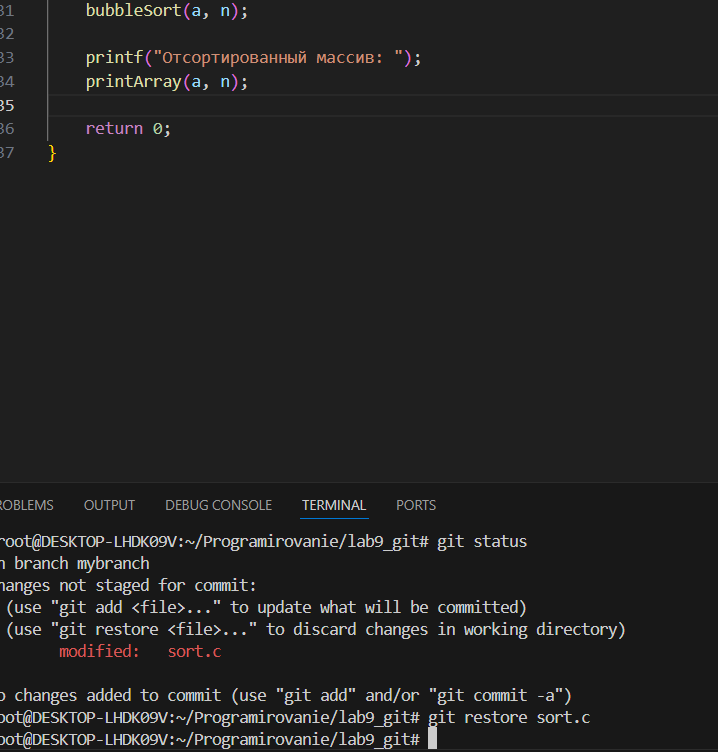
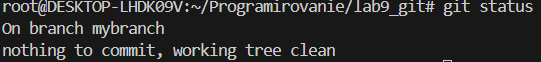

# Вторая часть задание на чертверку

### 1. Создал файл greeting.txt, проиндексировал его и закоммитил с сообщением “Add file greeting.txt” 

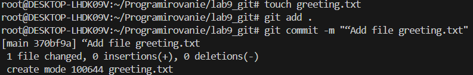

### 2. Добавил в этот файл слово hello, индексировал и коммитил с текстом "Add content to greeting.txt"  

### 3-5. Создал ветку с именем feature/uppercase, переключ. на неё, посмотрел, что в git status

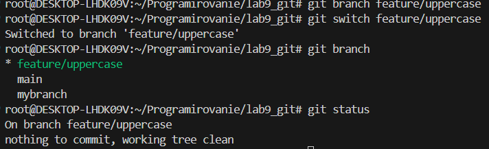

### 6-8. Отредактировал greeting.txt (HELLO), сделал add и commit, далее посмотрел, что выводит branch

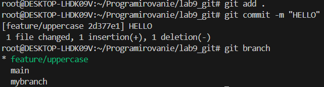

### 9. Посмотрел каков вывод git log --oneline --graph --all

### 10-12. Переключ. на гл. ветку, использовал cat, чтобы увидеть содерж. нашего файла и сравнил ветки

### 13-14. Объед. ветки и использовал cat, чтобы увидеть содерж. файла

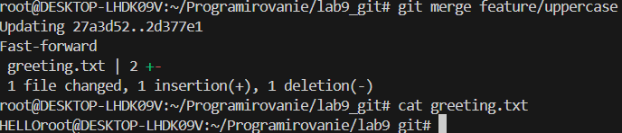

### 15-19. Удалил новую ветку, смержил ветку  mybranch в main, посмотрел, что выводит git log --oneline --graph --all, запушил измен. и документ

