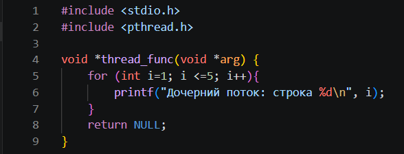
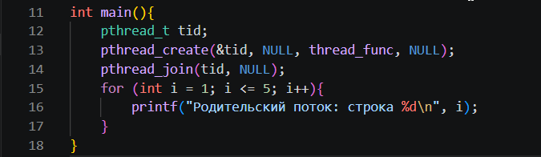
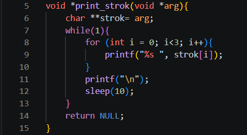
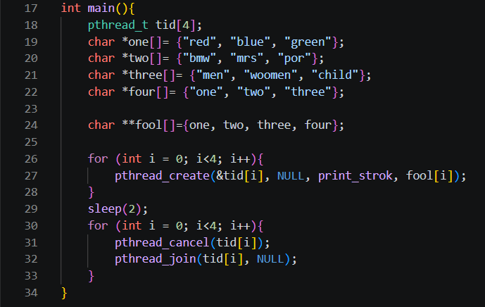
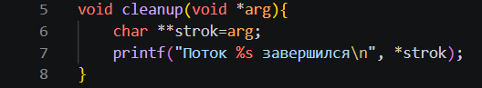
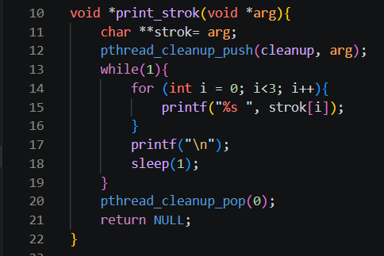
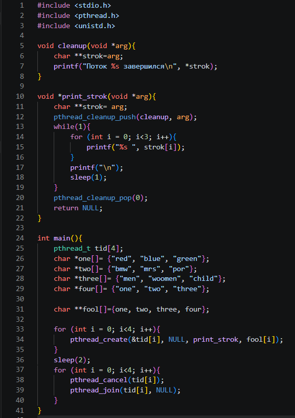

### **ОЦЕНКА 3**

## 1 - 2 задание (создать поток и ожидание потока)

*Рисунок 1 — Функция дочерних потоков.*

*Рисунок 2 — Создание дочернего потока и правильный вывод обоих потоков.*

## 3 - 4 задание (параметры потока и завершение нити без ожидания)

*Рисунок 3 — Создание потоков с прерыванием до завершения.*

*Рисунок 4 — Функция для дочерних потоков и структура для передачи разных данных в потоки.*

## 5 задание (обработать завершение потока)

*Рисунок 5-6 — Добавлены функция cleanup() и вызовы pthread_cleanup_push()/pthread_cleanup_pop() для обработки завершения потока.*

## 6 задание (реализовать простой Sleepsort)

*Рисунок 7 — Реализация Sleepsort.*